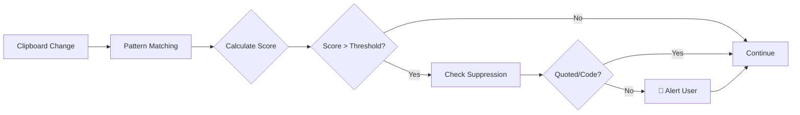

<div align="center">

# 🛡️ Paste of Shame

### **Stop embarrassing AI-generated content before you paste it**

*Your personal clipboard watchdog that catches LLM boilerplate in real-time*

[](https://github.com/NoxelS/paste-of-shame/releases)
[](https://github.com/NoxelS/paste-of-shame/actions/workflows/ci.yml)
[](https://github.com/NoxelS/paste-of-shame/actions/workflows/test.yml)
[](https://github.com/NoxelS/paste-of-shame/blob/main/LICENSE)
[](https://www.python.org)

<h3>
  <a href="#-download">Download</a>
  <span> • </span>
  <a href="#-features">Features</a>
  <span> • </span>
  <a href="#-quick-start">Quick Start</a>
  <span> • </span>
  <a href="docs/MACOS_APP.md">Documentation</a>
</h3>

</div>

---

## 🎯 Why Paste of Shame?

Ever copy-pasted AI-generated content and **forgot to remove the telltale phrases**?

- *"As an AI language model, I cannot..."* ❌
- *"Certainly! Here is the code you requested..."* ❌  
- *"I hope this helps! Feel free to ask if..."* ❌

**Paste of Shame catches these embarrassing moments before they happen.**

### ✨ Core Principles

<table>
<tr>
<td align="center" width="33%">
  <h3>🔒 100% Private</h3>
  <p><strong>Zero network calls</strong><br/>Everything runs locally on your machine. Your clipboard data never leaves your computer.</p>
</td>
<td align="center" width="33%">
  <h3>⚡ Lightning Fast</h3>
  <p><strong>No AI/ML required</strong><br/>Deterministic pattern matching means instant detection with zero latency.</p>
</td>
<td align="center" width="33%">
  <h3>🎁 Free Forever</h3>
  <p><strong>Open source (MIT)</strong><br/>Free to use, modify, and distribute. No subscriptions, no limits.</p>
</td>
</tr>
</table>

---

## 📥 Download

<div align="center">

### macOS Application (Recommended)

**Native menu bar app with instant notifications**

<a href="https://github.com/NoxelS/paste-of-shame/releases/latest">
  
</a>

<sub>Universal Binary • 10MB • macOS 10.15 (Catalina) or later</sub>

**Or install via command line:**

```bash
# Download and install latest release
curl -L https://github.com/NoxelS/paste-of-shame/releases/latest/download/PasteOfShame-*-macOS.dmg -o PasteOfShame.dmg
open PasteOfShame.dmg
# Drag to Applications folder
```

---

### CLI Installation (All Platforms)

<table>
<tr>
<td align="center" width="33%">
  
</td>
<td align="center" width="33%">
  
</td>
<td align="center" width="33%">
  
</td>
</tr>
</table>

```bash
# Using uv (recommended)
pip install uv
uv sync
uv run paste-of-shame watch

# Using pip
pip install -e .
paste-of-shame watch
```

</div>

---

## 🚀 Features

<table>
<tr>
<td width="50%">

### 🔍 Real-Time Monitoring
Watches your clipboard continuously with smart adaptive polling. Zero performance impact.

### 🎯 25+ Detection Patterns
Catches common LLM phrases across multiple categories:
- AI self-identification
- Polite boilerplate ("Certainly!", "Of course!")
- Refusal patterns ("I cannot assist...")
- Code submission markers
- Conclusion phrases

### 🛡️ Smart Suppression
Automatically ignores:
- Quoted text and email replies
- Code blocks and fenced content
- Legitimate documentation

</td>
<td width="50%">

### 🔔 Instant Notifications
Native desktop alerts on macOS, Linux, and Windows with sound and visual indicators.

### 📊 Configurable Threshold
Adjust sensitivity from 0.1-1.0 to match your workflow. See statistics and scores in real-time.

### 🌍 Cross-Platform
Works everywhere:
- macOS (menu bar app + CLI)
- Linux (CLI + systemd)
- Windows (CLI + background service)

### ⚡ Lightning Performance
Scans 100KB of text in under 200ms. No AI models, no API calls, pure pattern matching.

</td>
</tr>
</table>

---

## ⚡ Quick Start

### Option 1: macOS Menu Bar App (Easiest)

<table>
<tr>
<td width="60px" align="center">1️⃣</td>
<td>Download the <code>.dmg</code> from <a href="https://github.com/NoxelS/paste-of-shame/releases/latest">releases</a> and drag to Applications</td>
</tr>
<tr>
<td align="center">2️⃣</td>
<td>Launch "Paste of Shame" from Spotlight or Applications</td>
</tr>
<tr>
<td align="center">3️⃣</td>
<td>Click the ⚠️ icon in menu bar → <strong>Start Watching</strong></td>
</tr>
<tr>
<td align="center">🎉</td>
<td>That's it! You'll get notifications when LLM boilerplate is detected</td>
</tr>
</table>

**Menu Features:**
- 🟢/🔴 Start/Stop watching
- 📊 View detection statistics
- 🎚️ Adjust threshold
- 🔄 Reload config on-the-fly

---

### Option 2: CLI (All Platforms)


#### 🔄 Watch Mode (Background Daemon)

Start monitoring your clipboard continuously:

```bash
paste-of-shame watch
```

<details>
<summary>Example Output</summary>

```
Starting clipboard monitor (threshold: 0.5)...
Press Ctrl+C to stop

⚠️  WARNING: LLM boilerplate detected! (score: 0.75)
Matched patterns:
  • "Certainly!" (category: polite_opening, score: 0.3)
  • "Here is the code" (category: code_markers, score: 0.25)
  • "I hope this helps" (category: encouragement, score: 0.2)
```

</details>

#### 🔍 Scan Mode (On-Demand)

Test text without starting the daemon:

```bash
```bash
# Scan text directly
paste-of-shame scan "As an AI language model, I cannot help with that."

# Scan from stdin
echo "Certainly! Here is the code." | paste-of-shame scan

# JSON output for scripts
paste-of-shame scan --json "Below is the implementation."
```

#### ⚙️ Configuration

```bash
# Show config location and current settings
paste-of-shame config

# List all 25+ built-in detection rules
paste-of-shame rules
```

**Config file location:**
- macOS: `~/Library/Application Support/paste-of-shame/config.yml`
- Linux: `~/.config/paste-of-shame/config.yml`
- Windows: `%APPDATA%\paste-of-shame\config.yml`

---

## 🔬 How It Works

<div align="center">


</div>

<br/>



### Detection Categories

| Category | Examples | Weight |
|----------|----------|--------|
| 🤖 **AI Self-ID** | "As an AI language model", "I'm Claude/GPT" | High (0.4) |
| 🎭 **Polite Opening** | "Certainly!", "Of course!", "Absolutely!" | Medium (0.3) |
| 🚫 **Refusal** | "I cannot assist", "I'm unable to", "I don't have access" | High (0.35) |
| 📝 **Code Markers** | "Here is the code", "Below is the implementation" | Medium (0.25) |
| 💬 **Encouragement** | "Feel free to ask", "I encourage you to" | Low (0.2) |
| 🎬 **Conclusions** | "In conclusion", "To summarize", "I hope this helps" | Low (0.2) |

**Smart Suppression:**
- Ignores text inside `> quote blocks`
- Skips fenced code blocks (` ``` `)
- Filters legitimate documentation phrases

---

## 📚 Library Usage

Use Paste of Shame in your own Python projects:

```python
from pasteofshame import Detector, RulePack

# Initialize detector
detector = Detector(rule_pack=RulePack.builtin())

# Scan text
result = detector.scan("Certainly! Here is the code you requested.")

# Check results
if result.is_warning:
    print(f"⚠️  Score: {result.total_score}")
    for match in result.matches:
        print(f"  • {match.pattern} (score: {match.score})")
```

**Example Output:**
```
⚠️  Score: 0.55
  • Certainly! (score: 0.3)
  • Here is the code (score: 0.25)
```

---

## 🛠️ Development

### Setup

```bash
# Clone repository
git clone https://github.com/NoxelS/paste-of-shame.git
cd paste-of-shame

# Install dependencies with uv
pip install uv
uv sync

# Run tests
uv run pytest

# Build macOS app (macOS only)
make build-app
make build-dmg
```

### Testing

```bash
# Run all tests
uv run pytest

# Run with coverage
uv run pytest --cov=pasteofshame --cov-report=html

# Performance benchmarks
uv run pytest tests/test_performance.py -v

# Type checking
uv run mypy pasteofshame

# Linting
uv run ruff check pasteofshame
uv run ruff format pasteofshame
```

### Building

```bash
# macOS app bundle
make build-app          # Development build
make build-dmg          # Production DMG installer

# Clean build artifacts
make clean-app
```

---

## 🤝 Contributing

Contributions are welcome! See [CONTRIBUTING.md](CONTRIBUTING.md) for guidelines.

**Ways to contribute:**
- 🐛 Report bugs or issues
- 💡 Suggest new detection patterns
- 🔧 Submit pull requests
- 📝 Improve documentation
- ⭐ Star the repository

---

## 📄 License

MIT License - free to use, modify, and distribute.

See [LICENSE](LICENSE) for full details.

---

## 🙏 Acknowledgments

Built with:
- [py2app](https://py2app.readthedocs.io/) - macOS app bundling
- [rumps](https://github.com/jaredks/rumps) - macOS menu bar integration
- [pyperclip](https://github.com/asweigart/pyperclip) - Cross-platform clipboard access
- [uv](https://github.com/astral-sh/uv) - Fast Python package manager

Inspired by the need to catch embarrassing AI boilerplate before it reaches production.

---

<div align="center">

### ⭐ Star this repo if it saved you from an embarrassing paste!

Made with ❤️ by [Noel Schwabenland](https://github.com/NoxelS)

[Report Bug](https://github.com/NoxelS/paste-of-shame/issues) • [Request Feature](https://github.com/NoxelS/paste-of-shame/issues) • [Documentation](docs/MACOS_APP.md)

</div>
